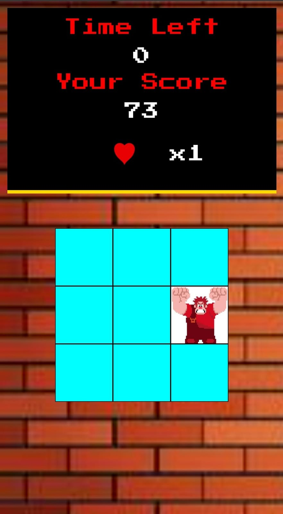

# 🕹️ Detona Ralph – Mini Game em JavaScript

Bem-vindo ao **Detona Ralph**, um jogo simples desenvolvido com **HTML**, **CSS** e **JavaScript** para treinar lógica, eventos e manipulação da DOM.

O objetivo é simples:
👉 **Clique no Ralph sempre que ele aparecer na tela.**  
Quanto mais rápido você for, maior será sua pontuação.

---

## 🚀 Tecnologias utilizadas

- **HTML5**
- **CSS3**
- **JavaScript**

---

## 🎮 Como jogar

1. O Ralph aparece em posições aleatórias na tela.  
2. Clique nele antes que desapareça.  
3. Cada clique aumenta sua pontuação.  
4. O jogo possui timer de 60 segundos para você fazer usa pontuação, o placar é alterado sempre que você acerta o Ralph e a velocidade  já vem configurada.
5. Para ganhare você precisa fazer pelo menos 30 pontos.
6. Para jogar novamente basta recarregar a página.

---

## 📂 Estrutura do projeto
```
/
├── index.html # Estrutura principal do jogo
├── style.css # Estilos e layout
├── script.js # Lógica e mecânica do jogo
└── assets/ # Imagens, ícones e mídias
```


---

## 🧠 Conceitos praticados

- Manipulação da DOM
- Eventos de clique
- Uso de `setInterval()` e `setTimeout()`
- Cálculo de posições aleatórias na tela
- Responsividade básica
- Organização de projeto para GitHub Pages

---

## 🌐 Link para jogar

🔗 **https://joaoalves-devv.github.io/detona-ralph/**

---

## 📸 Prévia (opcional)

> Versão mobile:




---

## 📄 Licença

Projeto livre para estudo e evolução.  
Sinta-se à vontade para melhorar, criar novas fases e adicionar novos funcionalidades! ⭐
